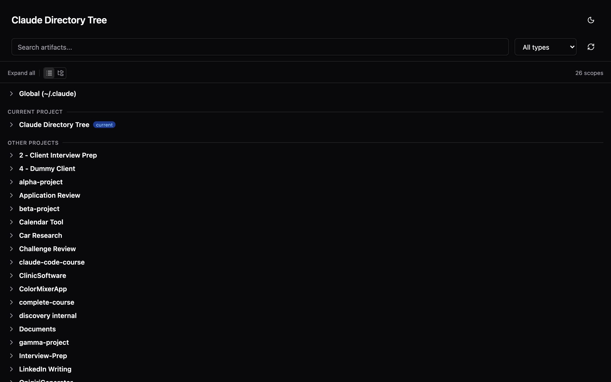
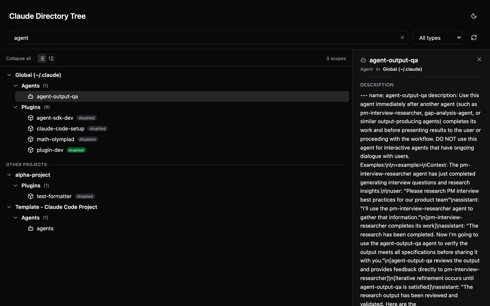
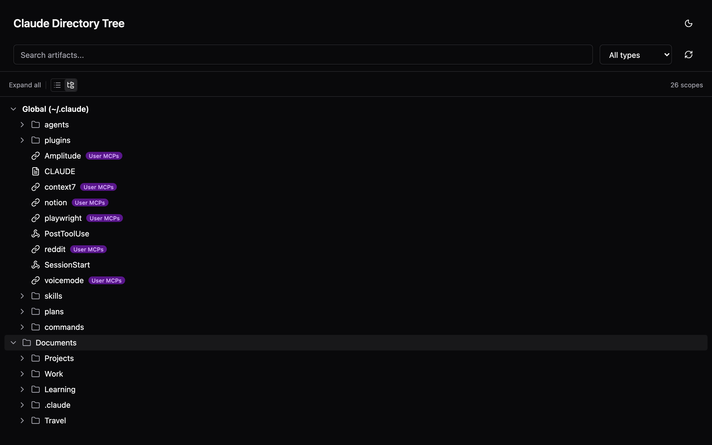
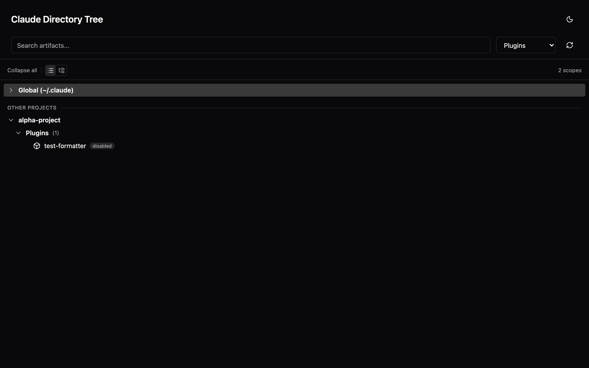
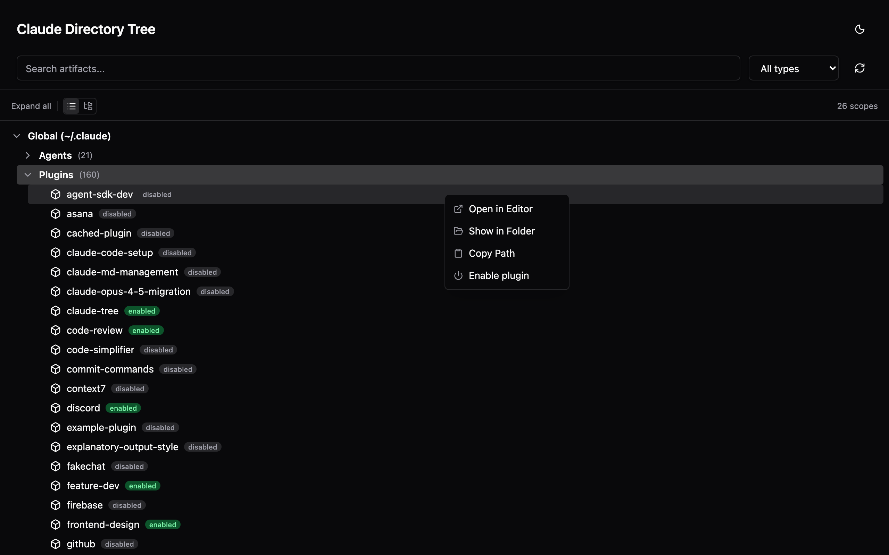
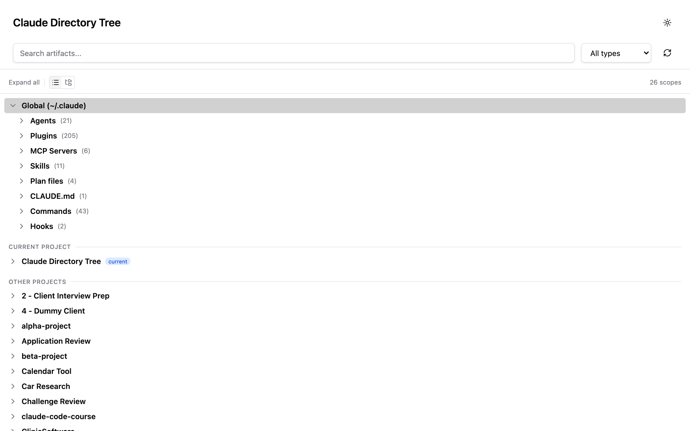

# Claude Directory Tree

Visual explorer for all your Claude Code artifacts across projects and scopes.



## What it does

- See all Claude artifacts (skills, agents, commands, plugins, hooks, CLAUDE.md, MCP servers, memory) in one tree view
- Organize by scope (flat) or filesystem hierarchy (directory view)
- Copy, move, promote (project to global), and demote (global to project) artifacts
- Search and filter by name or type
- Toggle plugins on/off directly from the UI

All projects you've used with Claude Code are auto-discovered. No manual setup needed.

Works on macOS, Linux, and Windows.

## Install

### As a Claude Code Plugin

```bash
# Add the marketplace
/plugin marketplace add 4qan/claude-directory-tree

# Install the plugin
/plugin install claude-tree@claude-directory-tree
```

Then use `/claude-tree:launch` to open the UI.

### As a Standalone CLI

```bash
npx claude-directory-tree
```

Or install globally:

```bash
npm install -g claude-directory-tree
claude-directory-tree
```

## Usage

```bash
# Launch from current directory
npx claude-directory-tree

# Launch from a specific directory (macOS/Linux)
npx claude-directory-tree /path/to/projects

# Launch from a specific directory (Windows)
npx claude-directory-tree C:\Users\you\projects
```

## Features

### Search and detail panel

Find artifacts across all projects. Click any artifact to see its description and available actions.



### Artifact operations

Right-click any artifact to manage it across scopes.


- **Copy to** - duplicate an artifact to another project's `.claude/` directory
- **Move to** - move an artifact to another project (removes from source)
- **Promote to Global** - copy a project-level artifact to `~/.claude/` so it's available everywhere
- **Demote to Project** - copy a global artifact into a specific project's scope

All operations detect conflicts. If the target already has a file with the same name, you'll be prompted to overwrite or cancel.

### Directory view

Switch between flat scope view and filesystem hierarchy to see where artifacts live on disk.



### Type filtering

Filter by artifact type (agents, commands, plugins, skills, hooks, MCP servers, etc.).



### Plugin management

Enable or disable plugins directly from the context menu or detail panel.



### Light and dark mode



## Requirements

- Node.js >= 20.17.0
- Claude Code >= 1.0.33 (for plugin install)
- macOS, Linux, or Windows

## Development

```bash
git clone https://github.com/4qan/claude-directory-tree.git
cd claude-directory-tree
npm install
npm run build
npm test
```

## License

MIT
