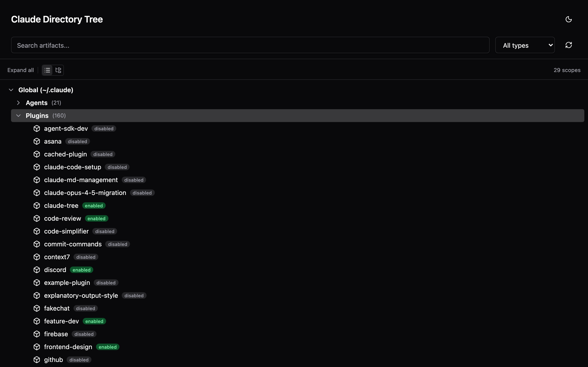
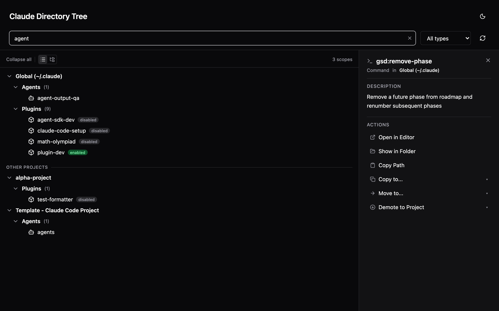
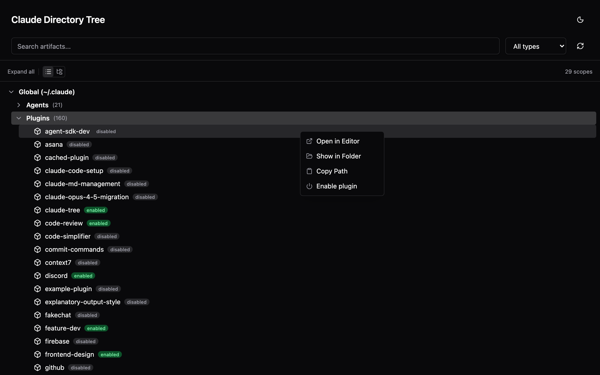
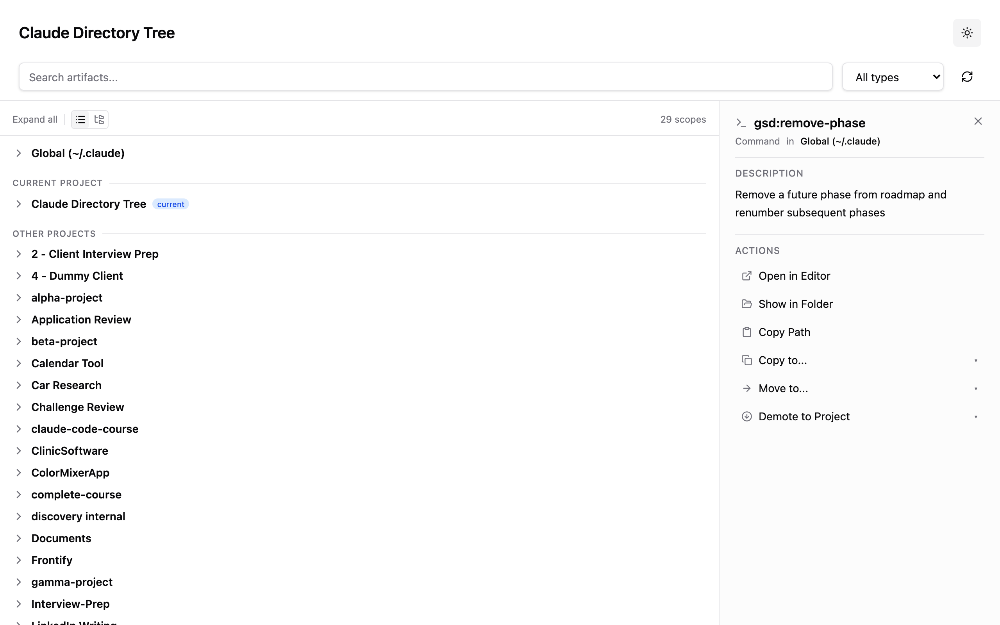

# Claude Directory Tree

Visual explorer for all your Claude Code artifacts across projects and scopes.



## What it does

- See all Claude artifacts (skills, agents, commands, plugins, hooks, CLAUDE.md, MCP servers, memory) in one tree view
- Organize by scope (global vs project) or filesystem hierarchy
- Copy, move, promote (project to global), and demote (global to project) artifacts
- Search and filter by name or type
- Toggle plugins on/off directly from the UI

All projects you've used with Claude Code are auto-discovered. No manual setup needed.

## Install

### As a Claude Code Plugin

```bash
# Add the marketplace
/plugin marketplace add 4qan/claude-directory-tree

# Install the plugin
/plugin install claude-tree@claude-directory-tree
```

Then use `/claude-tree:launch` to open the UI.

### As a Standalone CLI

```bash
npx claude-directory-tree
```

Or install globally:

```bash
npm install -g claude-directory-tree
claude-directory-tree
```

## Usage

```bash
# Launch from current directory
npx claude-directory-tree

# Launch from a specific directory
npx claude-directory-tree /path/to/projects
```

## Features

**Search and detail panel** - Find artifacts across all projects, see descriptions and actions at a glance.



**Context menu** - Right-click any artifact to open in editor, copy path, or manage plugins.



**Light and dark mode**



- Flat scope view and directory hierarchy view with toggle
- Context menu with copy, move, promote, demote actions
- Conflict detection with overwrite prompt
- Detail panel showing artifact summaries
- Local only, no network calls, no telemetry

## Requirements

- Node.js >= 20.17.0
- Claude Code >= 1.0.33 (for plugin install)

## Development

```bash
git clone https://github.com/4qan/claude-directory-tree.git
cd claude-directory-tree
npm install
npm run build
npm test
```

## License

MIT
